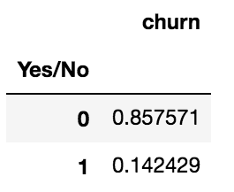
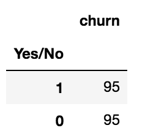
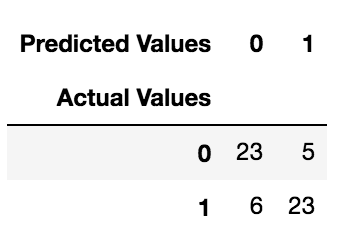

## Churn Analysis

This project was done in collaboration with [Corey Girard](https://github.com/coreygirard/)

&nbsp;&nbsp;&nbsp;&nbsp;&nbsp;&nbsp;&nbsp;&nbsp;&nbsp;&nbsp;&nbsp;&nbsp;&nbsp;&nbsp;&nbsp;&nbsp;&nbsp;&nbsp;&nbsp;
      
<br>

<p align="center">
  
</p>                                                                  
<p align="center">
  <a href="#Problem Statement"> Problem Statement </a> •
  <a href="#goals"> Goals </a> •
  <a href="#importance"> Why this is important? </a> •
  <a href="#mods"> Importing modules </a> 
  <a href="#dh"> Data Handling and Feature Engineering </a>
  <a href="#rf"> Building a random forest classifier using GridSearch to optimize hyperparameters </a>
</p>


<a id = 'goals'></a>
### Goals
From Wikipedia, 

> Churn rate is a measure of the number of individuals or items moving out of a collective group over a specific period. It is one of two primary factors that determine the steady-state level of customers a business will support [...] It is an important factor for any business with a subscriber-based service model, [such as] mobile telephone networks.

Our goal in this analysis was to predict the churn rate from a mobile phone company based on customer attributes including:
- Area code
- Call duration at different hours
- Charges
- Account length

See [this website](http://blog.yhat.com/posts/predicting-customer-churn-with-sklearn.html) for a similar analysis.

<a id = 'importance'></a>
### Why this is important? 

It is a well-known fact that in several businesses (particularly the ones involving subscriptions), the acquisition of new customers costs much more than the retention of existing ones. A thorough analysis of what causes churn-rates and how to predict them can be used to build efficient customer retention strategies.

<a id = 'mods'></a>
## Importing modules
```
from sklearn.model_selection import cross_val_score, train_test_split, GridSearchCV
from sklearn.ensemble import RandomForestClassifier
import pandas as pd
import seaborn as sns
import numpy as np
import matplotlib.pyplot as plt
%matplotlib inline
```


<a id = 'dh'></a>
## Data Handling and Feature Engineering

### Reading the data

```
df = pd.read_csv("data.csv")
```

### Convert binary strings to boolean ints

```
df['international_plan'] = df.international_plan.replace({'Yes': 1, 'No': 0})
df['voice_mail_plan'] = df.voice_mail_plan.replace({'Yes': 1, 'No': 0})
```

### Convert booleans to boolean ints
```
df['churn'] = df.churn.replace({True: 1, False: 0})
```
### Handle state dummies

```
state_dummies = pd.get_dummies(df.state)
state_dummies.columns = ['state_'+c.lower() for c in state_dummies.columns.values]
df.drop('state', axis='columns', inplace=True)
df = pd.concat([df, state_dummies], axis='columns')
```

### Handle area code dummies

```
area_dummies = pd.get_dummies(df.area_code)
area_dummies.columns = ['area_code_'+str(c) for c in area_dummies.columns.values]
df.drop('area_code', axis='columns', inplace=True)
df = pd.concat([df, area_dummies], axis='columns')
```

### Feature Engineering
```
df['total_minutes'] = df.total_day_minutes + df.total_eve_minutes + df.total_intl_minutes
df['total_calls'] = df.total_day_calls + df.total_eve_calls + df.total_intl_calls
df['total_charge'] = df.total_day_charge + df.total_eve_charge + df.total_intl_charge

df['avg_day_rate_by_minute'] = df.total_day_charge / df.total_day_minutes
df['avg_day_rate_by_call'] = df.total_day_charge / df.total_day_calls

df['avg_eve_rate_by_minute'] = df.total_eve_charge / df.total_eve_minutes
df['avg_eve_rate_by_call'] = df.total_eve_charge / df.total_eve_calls

df['avg_night_rate_by_minute'] = df.total_night_charge / df.total_night_minutes
df['avg_night_rate_by_call'] = df.total_night_charge / df.total_night_calls

df['avg_intl_rate_by_minute'] = df.total_intl_charge / df.total_intl_minutes
df['avg_intl_rate_by_call'] = df.total_intl_charge / df.total_intl_calls
df.fillna(value=0.0, inplace=True) # three people made no international calls, apparently

df['pct_calls_left_voicemail'] = df.number_vmail_messages / df.total_calls

df['ratio_minutes_day_eve'] = df.total_day_minutes / df.total_eve_minutes
df['ratio_minutes_day_night'] = df.total_day_minutes / df.total_night_minutes
df['ratio_minutes_eve_night'] = df.total_eve_minutes / df.total_night_minutes

df['ratio_calls_day_eve'] = df.total_day_calls / df.total_eve_calls
df['ratio_calls_day_night'] = df.total_day_calls / df.total_night_calls
df['ratio_calls_eve_night'] = df.total_eve_calls / df.total_night_calls
```

### Features and target
```
X = df[[c for c in df.columns if c != 'churn']]
y = df.churn
```

The package `pandas-profiling` contains a method `get_rejected_variables(threshold)` which identifies variables with correlation higher than a threshold.

### Using pandas profiling
```
!pip install pandas-profiling
import pandas_profiling
profile = pandas_profiling.ProfileReport(X)
```

### Rejecting variables with correlations above 0.9
```
rejected_variables = profile.get_rejected_variables(threshold=0.9)
X = X.drop(rejected_variables,axis=1)
```

### Scaling
```
from sklearn.preprocessing import StandardScaler
cols = X.columns.tolist()
scaler = StandardScaler()
X[cols] = scaler.fit_transform(X[cols])
X = X[cols]
```
<a id = 'rf'></a>
### Imbalanced classes

The `churn` class is imbalanced. The following cell

```
df['churn'].value_counts()/df.shape[0]
```
has output:

<p align="center">
  
</p> 


We can account for imbalanced classes using:
- Undersampling: randomly sample the majority class, artificially balancing the classes when fitting the model
- Oversampling: boostrap (sample with replacement) the minority class to balance the classes when fitting the model. We can oversample using the SMOTE algorithm (Synthetic Minority Oversampling Technique)

Note that it is crucial that we evaluate our model **on the real data**.

I will use the usual undersampling method creating a 50/50 ratio. I will choose randomly the elements of the majority class (the random sample size will naturally be equal to the size of the minority class).

To do that let us concatenate the features and target again:

```df_scaled = pd.concat([X,y],axis=1)
```

The number of churns, the corresponding row indexes and the non-churn rows indices are:

```
num_churns = len(df_scaled[df_scaled['churn'] == 1])
churns_indices = np.array(df_scaled[df_scaled['churn'] == 1].index)
non_churn_indices = df_scaled[df_scaled['churn'] == 0].index
```

Randomly selecting from the majority, joining indices and undersampling the data we have:

```
random_non_churn_indices = np.random.choice(non_churn_indices, num_churns, replace = False)
random_non_churn_indices = np.array(random_non_churn_indices)
undersample_ind = np.concatenate([churns_indices,random_non_churn_indices])
undersample = df_scaled.iloc[undersample_ind,:]
X_und = undersample.ix[:, undersample.columns != 'churn']
y_und = undersample.ix[:, undersample.columns == 'churn']
df_und = pd.concat([X_und,y_und],axis=1)
df_und['churn'].value_counts()
```
The output is:

<p align="center">
  
</p> 


Redefining our variables

```
X = X_und
y = y_und
y = y.churn
```

we can build our models.


<a id = 'rf'></a>
## Building a random forest classifier using `GridSearch` to optimize hyperparameters

### Finding best hyperparameters

```
n_estimators = list(range(20,160,10))
max_depth = list(range(2, 16, 2)) + [None]
def rfscore(X,y,test_size,n_estimators,max_depth):

    X_train, X_test, y_train, y_test = train_test_split(X, 
                                                        y, test_size = test_size, random_state=42) 
    rf_params = {
             'n_estimators':n_estimators,
             'max_depth':max_depth}   # parameters for grid search
    rf_gs = GridSearchCV(RandomForestClassifier(), rf_params, cv=5, verbose=1, n_jobs=-1)
    rf_gs.fit(X_train,y_train) # training the random forest with all possible parameters
    max_depth_best = rf_gs.best_params_['max_depth']      # getting the best max_depth
    n_estimators_best = rf_gs.best_params_['n_estimators']  # getting the best n_estimators
    print("best max_depth:",max_depth_best)
    print("best n_estimators:",n_estimators_best)
    best_rf_gs = RandomForestClassifier(max_depth=max_depth_best,n_estimators=n_estimators_best) # instantiate the best model
    best_rf_gs.fit(X_train,y_train)  # fitting the best model
    best_rf_score = best_rf_gs.score(X_test,y_test) 
    print ("best score is:",round(best_rf_score,3))
    preds = best_rf_gs.predict(X_test)
    df_pred = pd.DataFrame(np.array(preds).reshape(len(preds),1))
    df_pred.columns = ['predictions']
    print('Features and their importance:\n')
    feature_importances = pd.Series(best_rf_gs.feature_importances_, index=X.columns).sort_values().tail(10)
    print(feature_importances)
    print(feature_importances.plot(kind="barh", figsize=(6,6)))
    return (df_pred,max_depth_best,n_estimators_best)


triple = rfscore(X,y,0.3,n_estimators,max_depth)
```
```
df_pred = triple[0]
```
The predictions are:
```
df_pred['predictions'].value_counts()/df_pred.shape[0]
```

<p align="center">
  
</p> 


### Cross Validation
```
def cv_score(X,y,cv,n_estimators,max_depth):
    rf = RandomForestClassifier(n_estimators=n_estimators_best,
                                max_depth=max_depth_best)
    s = cross_val_score(rf, X, y, cv=cv, n_jobs=-1)
    return("{} Score is :{:0.3} ± {:0.3}".format("Random Forest", s.mean().round(3), s.std().round(3)))
```
```
dict_best = {'max_depth': triple[1], 'n_estimators': triple[2]}
n_estimators_best = dict_best['n_estimators']
max_depth_best = dict_best['max_depth']
cv_score(X,y,5,n_estimators_best,max_depth_best)
```
The output is:
```
'Random Forest Score is :0.774 ± 0.054'
```

### Confusion Matrix

```
X_train, X_test, y_train, y_test = train_test_split(X, 
                                                        y, test_size = 0.3, random_state=42) 

best_rf_gs = RandomForestClassifier(n_estimators=n_estimators_best,
                                max_depth=max_depth_best)

best_rf_gs.fit(X_train,y_train)  # fitting the best model
best_rf_score = best_rf_gs.score(X_test,y_test) 
preds = best_rf_gs.predict(X_test)
pd.crosstab(pd.concat([X_test,y_test],axis=1)['churn'], preds, 
            rownames=['Actual Values'], colnames=['Predicted Values'])
```
The confusion matrix is:

<p align="center">
  
</p> 
