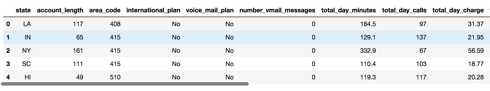
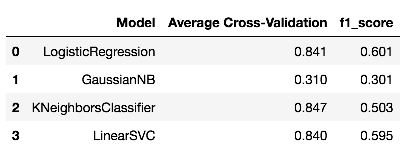
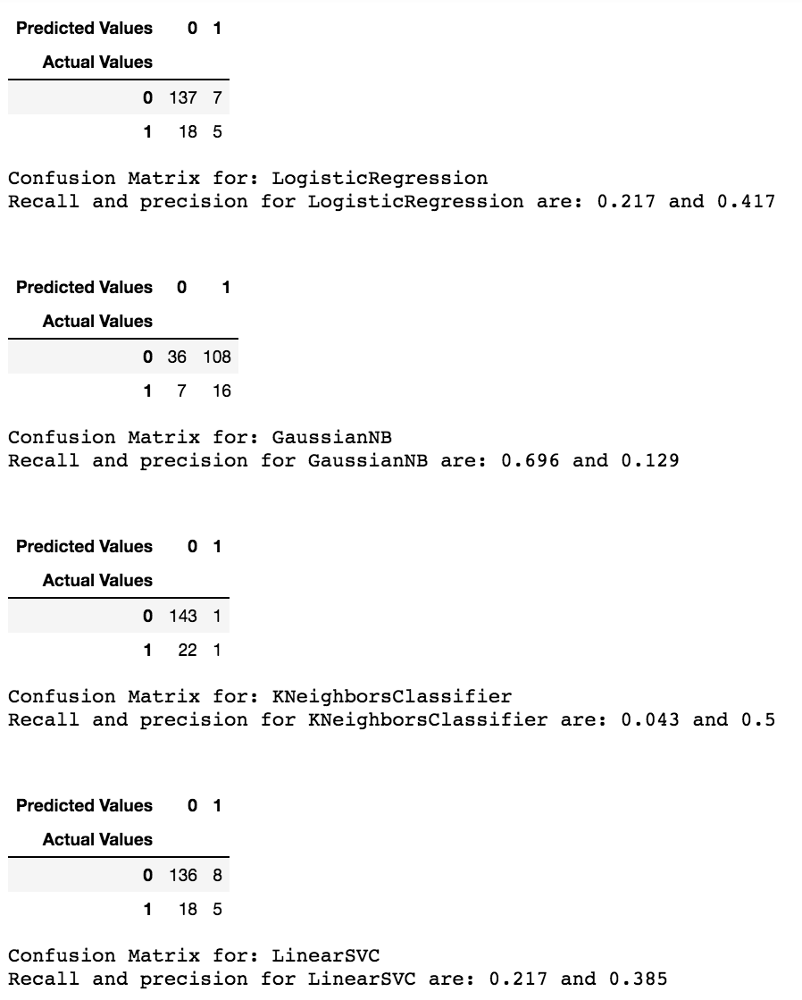
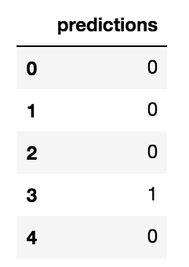

## Churn Analysis [[view code]](http://nbviewer.jupyter.org/github/marcotav/machine-learning-regression-models/blob/master/retail/notebooks/retail-recommendations.ipynb)
      

**The code is available [here](http://nbviewer.jupyter.org/github/marcotav/machine-learning-regression-models/blob/master/retail/notebooks/retail-recommendations.ipynb) or by clicking on the.**

This project was done in collaboration with [Corey Girard](https://github.com/coreygirard/)

<br>

<p align="center">
  
</p>                                                                  
<p align="center">
  <a href="#goals"> Goals </a> •
  <a href="#importance"> Why this is important? </a> •
  <a href="#mods"> Importing modules and reading the data </a> •
  <a href="#dh"> Data Handling and Feature Engineering </a> •
  <a href="#Xy"> Features and target </a> •
  <a href="#pp"> Using `pandas-profiling` and rejecting variables with correlations above 0.9 </a> •
  <a href="#scale">  Scaling </a> •
  <a href="#mc">  Model Comparison </a> •
  <a href="#rf"> Building a random forest classifier using GridSearch to optimize hyperparameters </a>
</p>


<a id = 'goals'></a>
### Goals
From Wikipedia, 

> Churn rate is a measure of the number of individuals or items moving out of a collective group over a specific period. It is one of two primary factors that determine the steady-state level of customers a business will support [...] It is an important factor for any business with a subscriber-based service model, [such as] mobile telephone networks.

Our goal in this analysis was to predict the churn rate from a mobile phone company based on customer attributes including:
- Area code
- Call duration at different hours
- Charges
- Account length

See [this website](http://blog.yhat.com/posts/predicting-customer-churn-with-sklearn.html) for a similar analysis.

<a id = 'importance'></a>
### Why this is important? 

It is a well-known fact that in several businesses (particularly the ones involving subscriptions), the acquisition of new customers costs much more than the retention of existing ones. A thorough analysis of what causes churn-rates and how to predict them can be used to build efficient customer retention strategies.

<a id = 'mods'></a>
## Importing modules and reading the data
```
from sklearn.model_selection import cross_val_score, train_test_split, GridSearchCV
from sklearn.ensemble import RandomForestClassifier
import pandas as pd
import seaborn as sns
import numpy as np
import matplotlib.pyplot as plt
%matplotlib inline
```
Reading the data:
```
df = pd.read_csv("data.csv")
```
<p align="center">
  
</p> 

<a id = 'dh'></a>
## Data Handling and Feature Engineering
In this section the following steps are taken:
- Conversion of strings into booleans 
- Conversion of booleans to integers
- Converting the states column into dummy columns
- Creation of several new features (feature engineering)

The commented code follows (most of the lines were ommited for brevity):
```
# convert binary strings to boolean ints
df['international_plan'] = df.international_plan.replace({'Yes': 1, 'No': 0})
#convert booleans to boolean ints
df['churn'] = df.churn.replace({True: 1, False: 0})
# handle state and area code dummies
state_dummies = pd.get_dummies(df.state)
state_dummies.columns = ['state_'+c.lower() for c in state_dummies.columns.values]
df.drop('state', axis='columns', inplace=True)
df = pd.concat([df, state_dummies], axis='columns')
area_dummies = pd.get_dummies(df.area_code)
area_dummies.columns = ['area_code_'+str(c) for c in area_dummies.columns.values]
df.drop('area_code', axis='columns', inplace=True)
df = pd.concat([df, area_dummies], axis='columns')
# feature engineering
df['total_minutes'] = df.total_day_minutes + df.total_eve_minutes + df.total_intl_minutes
df['total_calls'] = df.total_day_calls + df.total_eve_calls + df.total_intl_calls
```

<a id = 'Xy'></a>
### Features and target
Defining the features matrix and the target (the churn):
```
X = df[[c for c in df.columns if c != 'churn']]
y = df.churn
```

<a id = 'pp'></a>
### Using `pandas-profiling` and rejecting variables with correlations above 0.9

The package `pandas-profiling` contains a method `get_rejected_variables(threshold)` which identifies variables with correlation higher than a threshold.
```
import pandas_profiling
profile = pandas_profiling.ProfileReport(X)
rejected_variables = profile.get_rejected_variables(threshold=0.9)
X = X.drop(rejected_variables,axis=1)
```
<a id = 'scale'></a>
### Scaling
```
from sklearn.preprocessing import StandardScaler
cols = X.columns.tolist()
scaler = StandardScaler()
X[cols] = scaler.fit_transform(X[cols])
X = X[cols]
```
We can now build our models.

<a id = 'mc'></a>
## Model Comparison

We can write a for loop that does the following:
- Iterates over a list of models, in this case GaussianNB, KNeighborsClassifier and LinearSVC
- Trains each model using the training dataset X_train and y_train
- Predicts the target using the test features X_test
- Calculates the `f1_score` and cross-validation score 
- Build a dataframe with that information

The code will also print out the confusion matrix from which "recall" and "precision" can be calculated:
- When a consumer churns, how often does my classifier predict that to happen. This is the "recall". 
- When the model predicts a churn, how often does that user actually churns? This is the "precision"

```
X_train, X_test, y_train, y_test = model_selection.train_test_split(X, y,
                            test_size=0.25, random_state=0)

models = [LogisticRegression, GaussianNB, 
          KNeighborsClassifier, LinearSVC]

lst = []
for model in models:
    clf = model().fit(X_train, y_train)
    y_pred = clf.predict(X_test)
    lst.append([i for i in (model.__name__, 
                            round(metrics.f1_score(y_test, 
                                                   y_pred, 
                                                   average="macro"),3))])
df = pd.DataFrame(lst, columns=['Model','f1_score'])

lst_av_cross_val_scores = []

for model in models:
    clf = model()
    cross_val_scores = (model.__name__, cross_val_score(clf, X, y, cv=5))
    av_cross_val_scores = list(cross_val_scores)[1].mean()
    lst_av_cross_val_scores.append(round(av_cross_val_scores,3))

model_names = [model.__name__ for model in models]

df1 = pd.DataFrame(list(zip(model_names, lst_av_cross_val_scores)))
df1.columns = ['Model','Average Cross-Validation']
df_all = pd.concat([df1,df['f1_score']],axis=1) 
```
<p align="center">
  
</p>

If we use cross-validation as our metric, we see that the `KNeighborsClassifier` has the best performance. 

Now we will look at confusion matrices. These are obtained as follows:

```
models_names = ['LogisticRegression', 'GaussianNB', 'KNeighborsClassifier', 'LinearSVC']
i=0
for preds in y_pred_lst:
    print('Confusion Matrix for:',models_names[i])
    i +=1
    print('')
    cm = pd.crosstab(pd.concat([X_test,y_test],axis=1)['churn'], preds, 
            rownames=['Actual Values'], colnames=['Predicted Values'])
    recall = round(cm.iloc[1,1]/(cm.iloc[1,0]+cm.iloc[1,1]),3)
    precision = round(cm.iloc[1,1]/(cm.iloc[0,1]+cm.iloc[1,1]),3)
    cm
    print('Recall for {} is:'.format(models_names[i-1]),recall)
    print('Precision for {} is:'.format(models_names[i-1]),precision,'\n')
    print('------------------------------------------------------------ \n')
```
The output is:

<p align="center">
  
</p> 

The highest recall is from `GaussianNB` and the highest precision from `KNeighborsClassifier`.

<a id = 'rf'></a>
### Finding best hyperparameters
As a complement let us use a Random Forest Classifier with GridSearch for hyperparameter optimization


```
n_estimators = list(range(20,160,10))
max_depth = list(range(2, 16, 2)) + [None]
def rfscore(X,y,test_size,n_estimators,max_depth):

    X_train, X_test, y_train, y_test = train_test_split(X, 
                                                        y, test_size = test_size, random_state=42) 
    rf_params = {
             'n_estimators':n_estimators,
             'max_depth':max_depth}   # parameters for grid search
    rf_gs = GridSearchCV(RandomForestClassifier(), rf_params, cv=5, verbose=1, n_jobs=-1)
    rf_gs.fit(X_train,y_train) # training the random forest with all possible parameters
    max_depth_best = rf_gs.best_params_['max_depth']      # getting the best max_depth
    n_estimators_best = rf_gs.best_params_['n_estimators']  # getting the best n_estimators
    print("best max_depth:",max_depth_best)
    print("best n_estimators:",n_estimators_best)
    best_rf_gs = RandomForestClassifier(max_depth=max_depth_best,n_estimators=n_estimators_best) # instantiate the best model
    best_rf_gs.fit(X_train,y_train)  # fitting the best model
    best_rf_score = best_rf_gs.score(X_test,y_test) 
    print ("best score is:",round(best_rf_score,3))
    preds = best_rf_gs.predict(X_test)
    df_pred = pd.DataFrame(np.array(preds).reshape(len(preds),1))
    df_pred.columns = ['predictions']
    print('Features and their importance:\n')
    feature_importances = pd.Series(best_rf_gs.feature_importances_, index=X.columns).sort_values().tail(10)
    print(feature_importances)
    print(feature_importances.plot(kind="barh", figsize=(6,6)))
    return (df_pred,max_depth_best,n_estimators_best)


triple = rfscore(X,y,0.3,n_estimators,max_depth)
```
```
df_pred = triple[0]
```
The predictions are:
```
df_pred['predictions'].value_counts()/df_pred.shape[0]
```

<p align="center">
  
</p> 


### Cross Validation
```
def cv_score(X,y,cv,n_estimators,max_depth):
    rf = RandomForestClassifier(n_estimators=n_estimators_best,
                                max_depth=max_depth_best)
    s = cross_val_score(rf, X, y, cv=cv, n_jobs=-1)
    return("{} Score is :{:0.3} ± {:0.3}".format("Random Forest", s.mean().round(3), s.std().round(3)))
```
```
dict_best = {'max_depth': triple[1], 'n_estimators': triple[2]}
n_estimators_best = dict_best['n_estimators']
max_depth_best = dict_best['max_depth']
cv_score(X,y,5,n_estimators_best,max_depth_best)
```
The output is:
```
'Random Forest Score is :0.774 ± 0.054'
```

For the random forest, the recall and precision found are:

```
recall: 0.286
precision 0.727
```

Both cross-validation score and precision of our `RandomForestClassifier` is the highest among the five models investigated.
