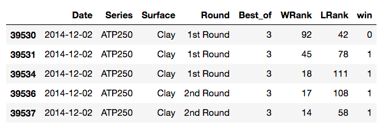
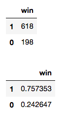
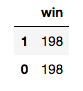
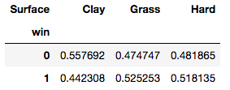
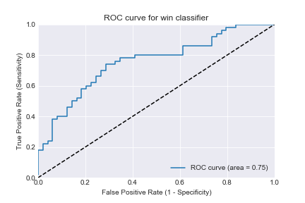
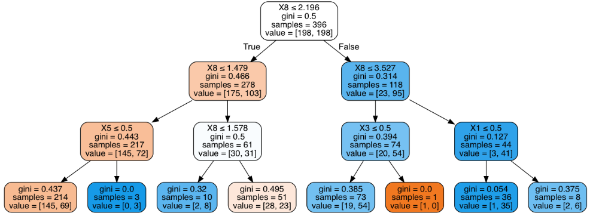
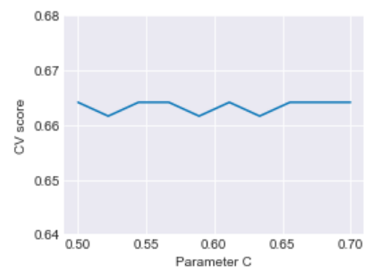
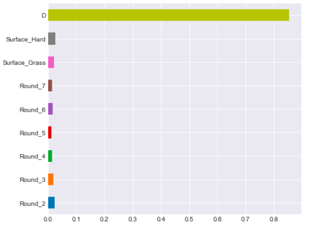

## Forecasting the winner in the Men's ATP World Tour [[view code]](http://nbviewer.jupyter.org/github/marcotav/machine-learning-classification-projects/blob/master/tennis/notebooks/Final_Project_Marco_Tavora-DATNYC41_GA.ipynb) 
      

**The code is available [here](http://nbviewer.jupyter.org/github/marcotav/machine-learning-classification-projects/blob/master/tennis/notebooks/Final_Project_Marco_Tavora-DATNYC41_GA.ipynb) or by clicking on the [view code] link above.**

<br>

<p align="center">
  
</p>                                                                  
<p align="center">
  <a href="#Problem Statement"> Problem Statement </a> •
  <a href="#Dataset"> Dataset </a> •
  <a href="#Importing basic modules"> Importing basic modules</a> •
  <a href="#Pre-Processing of dataset"> Pre-Processing of dataset</a><br> 
  <a href="#`Best_of` = 5"> `Best_of` = 5</a> •
  <a href="#Dummy variables">Dummy variables</a> •
  <a href="#Exploratory Analysis for Best_of = 5">Exploratory Analysis for Best_of = 5</a> •
  <a href="#Logistic Regression">Logistic Regression</a> •
  <a href="#Decision Trees and Random Forests">Decision Trees and Random Forests</a> 
</p>

<a id = 'Problem Statement'></a>
## Problem Statement

The goal of the project is to predict the probability that the higher-ranked player will win a tennis match. I will call that a `win`(as opposed to an upset). 
<a id = 'Dataset'></a>
## Dataset

Results for the men's ATP tour date back to January 2000 from the dateset http://www.tennis-data.co.uk/data.php (obtained from Kaggle). The features for each match that were used in the project were:
- `Date`: date of the match 
- `Series`: name of ATP tennis series (we kept the four main current categories namely Grand Slams, Masters 1000, ATP250, ATP500)
- `Surface`: type of surface (clay, hard or grass)
- `Round`: round of match (from first round to the final)
- `Best of`: maximum number of sets playable in match (Best of 3 or Best of 5)
- `WRank`: ATP Entry ranking of the match winner as of the start of the tournament
- `LRank`: ATP Entry ranking of the match loser as of the start of the tournament

The output variable is binary. The better player has higher rank by definition. The `win` variable is 1 if the higher-ranked player wins and 0 otherwise.
<a id = 'Importing basic modules'></a>
## Importing basic modules

```
import numpy as np
import statsmodels.api as sm
import matplotlib.pyplot as plt
from sklearn import metrics
import seaborn as sns
sns.set_style("darkgrid")
import pylab as pl
%matplotlib inline
```
<a id = 'Pre-Processing of dataset'></a>
## Pre-Processing of dataset

After loading the dataset we proceed as following:
- Keep only completed matches i.e. eliminate matches with injury withdrawals and walkovers.
- Choose the features listed above
- Drop `NaN` entries
- Consider the two final years only (to avoid comparing different categories of tournaments which existed in the past). Note that this choice is somewhat arbitrary and can be changed if needed.
- Choose only higher ranked players for better accuracy (as suggested by Corral and Prieto-Rodriguez (2010) and confirmed here)
```
# converting to Datetime
df_atp['Date'] = pd.to_datetime(df_atp['Date']) 
# Restricing dates
df_atp = df_atp.loc[(df_atp['Date'] > '2014-11-09') & (df_atp['Date'] <= '2016-11-09')]
# Keeping only completed matches
df_atp = df_atp[df_atp['Comment'] == 'Completed'].drop("Comment",axis = 1)
# Renaming Best of to Best_of
df_atp.rename(columns = {'Best of':'Best_of'},inplace=True)
# Choosing features
cols_to_keep = ['Date','Series','Surface', 'Round','Best_of', 'WRank','LRank']
# Dropping NaNs
df_atp = df_atp[cols_to_keep].dropna()
# Dropping errors in the dataset and unimportant entries (e.g. there are very few entries for Masters Cup)
df_atp = df_atp[(df_atp['LRank'] != 'NR') & (df_atp['WRank'] != 'NR') & (df_atp['Series'] != 'Masters Cup')]
```
Another important step for some of the columns is to transform strings into numerical values:
```
cols_to_keep = ['Best_of','WRank','LRank']
df_atp[cols_to_keep] = df_atp[cols_to_keep].astype(int)
```
I now create an extra column for the variable `win` (described above) using an auxiliary function `win(x)`:

```
def win(x):
    if x > 0:
        return 0
    elif x <= 0:
        return 1  
```
Using the `apply( )` method which sends a column to a function:
```
df_atp['win'] = (df_atp['WRank'] - df_atp['LRank']).apply(win)
```

Following [Corral and Prieto-Rodriguez](https://ideas.repec.org/a/eee/intfor/v26yi3p551-563.html) we restrict the analysis to higher ranked players:
```
df_new = df_atp[(df_atp['WRank'] <= 150) & (df_atp['LRank'] <= 150)]
```
<br>

<p align="center">
  
</p>                                   
                                 
<br> 

##  `Best_of` = 5

We now restrict our analysis to matches of `Best_of` = 5. Since only Grand Slams have 5 sets we can drop the `Series` column. The case of `Best_of = 3` will be considered afterwards.
```
df3 = df_new.copy()
df3 = df3[df3['Best_of'] == 5]
# Drop Best_of and Series columns
df3.drop(["Series",axis = 1,inplace=True)
df3.drop("Best_of",axis = 1,inplace=True)
```
The dataset is uneven in terms of frequency of `wins`(imbalanced classes). Using this quick function to convert `Series` to `DataFrame` (for aesthetic reasons only!)
```
def series_to_df(s):
    return s.to_frame()
series_to_df(df3['win'].value_counts())
series_to_df(df3['win'].value_counts()/df3.shape[0])
```
<br>

<p align="center">
  
</p>

To correct this problem, and create a balanced dataset via simple undersampling, I used a stratified sampling procedure. 

```
y_0 = df3[df3.win == 0] 
y_1 = df3[df3.win == 1] 
n = min([len(y_0), len(y_1)]) 
y_0 = y_0.sample(n = n, random_state = 0) 
y_1 = y_1.sample(n = n, random_state = 0)
df_strat = pd.concat([y_0, y_1]) 
X_strat = df_strat[['Date', 'Surface', 'Round','WRank', 'LRank']]
y_strat = df_strat.win
df = X_strat.copy()
df['win'] = y_strat
```
The balanced classes become:

<p align="center">
  
</p>

We now define the variables `P1` and `P2` where the former has higher ranking:
```
ranks = ["WRank", "LRank"]
df["P1"] = df[ranks].max(axis=1)
df["P2"] = df[ranks].min(axis=1)
```

<a id = 'Exploratory Analysis for Best_of = 5'></a>
## Exploratory Analysis for Best_of = 5

I first look at percentage of wins for each surface. We find that when the `Surface` is Clay there is a higher likelihood of upsets (opposite of wins) i.e. the percentage of wins is lower. The difference is not too large tough.
```
win_by_Surface = pd.crosstab(df.win, df.Surface).apply(lambda x: x/x.sum(), axis = 0)
```

<p align="center">
  
</p>

What about the dependence on rounds? The relation is not very clear but we can clearly see that upsets are unlikely to happen on the semifinals.

```
win_by_round = pd.crosstab(df.win, df.Round).apply(lambda x: x/x.sum(), axis = 0)
```
<p align="center">
  
</p>


<a id = 'Dummy variables'></a>
## Dummy variables
To keep the dataframe cleaner we transform the `Round` entries into numbers using: 
```
df1 = df.copy()
def round_number(x):
    if x == '1st Round':
        return 1
    elif x == '2nd Round':
        return 2
    elif x == '3rd Round':
        return 3
    elif x == '4th Round':
        return 4
    elif x == 'Quarterfinals':
        return 5
    elif x == 'Semifinals':
        return 6
    elif x == 'The Final':
        return 7
df1['Round'] = df1['Round'].apply(round_number)     
```
We then transform rounds into dummy variables
```
dummy_ranks = pd.get_dummies(df1['Round'], prefix='Round')
df1 = df1.join(dummy_ranks.ix[:, 'Round_2':])
rounds = ['Round_2', 'Round_3',
       'Round_4', 'Round_5', 'Round_6', 'Round_7']
df1[rounds] = df1[rounds].astype('int_')
```
We repeat this for the `Surface` variable. I now take the logarithms of `P1` and `P2`, then create a variable `D` 
```
df4['P1'] = np.log2(df4['P1'].astype('float64')) 
df4['P2'] = np.log2(df4['P2'].astype('float64')) 
df4['D'] = df4['P1'] - df4['P2']
df4['D'] = np.absolute(df4['D'])
```
<a id = 'Logistic Regression'></a>
## Logistic Regression

The next step is building the models. I first use a logistic regression. First, the `y` and `X` must be defined:

```
feature_cols = ['Round_2','Round_3','Round_4','Round_5','Round_6','Round_7','Surface_Grass','Surface_Hard','D']
dfnew = df4.copy()
dfnew[feature_cols].head()
X = dfnew[feature_cols]
y = dfnew.win
```
Doing a train-test split:
```
from sklearn.cross_validation import train_test_split
X_train, X_test, y_train, y_test = train_test_split(X, y, random_state=0)
```
I then fit the model with the training data,
```
from sklearn.linear_model import LogisticRegression
logreg = LogisticRegression()
logreg.fit(X_train, y_train)
```
and make predictions using the test set:
```
y_pred_class = logreg.predict(X_test)
from sklearn import metrics
print('Accuracy score is:',metrics.accuracy_score(y_test, y_pred_class))
```
and obtain:
```
Accuracy score is: 0.7070707070707071
```

The next step is evaluate the appropriate metrics. Using `scikit-learn` for calcule the AUC,
```
y_pred_prob = logreg.predict_proba(X_test)[:, 1]
auc_score = metrics.roc_auc_score(y_test, y_pred_prob)
print('AUC is:', auc_score)
```
I obtain the following `auc_score`:
```
AUC is: 0.7546938775510204
```
To plot the ROC curve I use:
```
fpr, tpr, thresholds = metrics.roc_curve(y_test, y_pred_prob)
fig = plt.plot(fpr, tpr,label='ROC curve (area = %0.2f)' % auc_score )
plt.plot([0, 1], [0, 1], 'k--')
plt.xlim([0.0, 1.0])
plt.ylim([0.0, 1.0])
plt.title('ROC curve for win classifier')
plt.xlabel('False Positive Rate (1 - Specificity)')
plt.ylabel('True Positive Rate (Sensitivity)')
plt.legend(loc="lower right")
plt.grid(True)
```
<br>

<p align="center">
  
</p>                                                                
<br> 

Now we must perform cross-validation. 
```
from sklearn.cross_validation import cross_val_score
print('Mean CV score is:',cross_val_score(logreg, X, y, cv=10, scoring='roc_auc').mean())
``` 
The output is:
```
Mean CV score is: 0.7287617728531856
```

<a id = 'Decision Trees and Random Forests'></a>
## Decision Trees and Random Forests


I now build a decision tree model to predict the upsets likelihood of a given match:

```
from sklearn.tree import DecisionTreeClassifier
model = DecisionTreeClassifier()
X = dfnew[feature_cols].dropna()
y = dfnew['win']
model.fit(X, y)
```
Again performing cross-validation:
```
scores = cross_val_score(model, X, y, scoring='roc_auc', cv=5)
print('AUC {}, Average AUC {}'.format(scores, scores.mean()))
model = DecisionTreeClassifier(
                max_depth = 4,
                min_samples_leaf = 6)

model.fit(X, y)
```
<br>

<p align="center">
  
</p>                                   
                                 
<br>

Evaluating the cross-validation score:

```
scores = cross_val_score(model, X, y, scoring='roc_auc', cv=5)
print('CV AUC {}, Average AUC {}'.format(scores, scores.mean()))
```

<br>

<p align="center">
  
</p>                                   
                                 
<br>


Now I repeat the lines above using a random forest classifier:
```
from sklearn.ensemble import RandomForestClassifier
from sklearn.cross_validation import cross_val_score
X = dfnew[feature_cols].dropna()
y = dfnew['win']
model = RandomForestClassifier(n_estimators = 200)
model.fit(X, y)
features = X.columns
feature_importances = model.feature_importances_
features_df = pd.DataFrame({'Features': features, 'Importance Score': feature_importances})
features_df.sort_values('Importance Score', inplace=True, ascending=False)
feature_importances = pd.Series(model.feature_importances_, index=X.columns)
feature_importances.sort_values()
feature_importances.plot(kind="barh", figsize=(7,6))
scores = cross_val_score(model, X, y, scoring='roc_auc')
print('AUC {}, Average AUC {}'.format(scores, scores.mean()))
for n_trees in range(1, 100, 10):
    model = RandomForestClassifier(n_estimators = n_trees)
    scores = cross_val_score(model, X, y, scoring='roc_auc')
    print('n trees: {}, CV AUC {}, Average AUC {}'.format(n_trees, scores, scores.mean()))
```
<br>

<p align="center">
  
</p>                                   
                                 
<br>


The same identical analysis is done for `Best_of = 3` and therefore it is ommited here in the README. 
